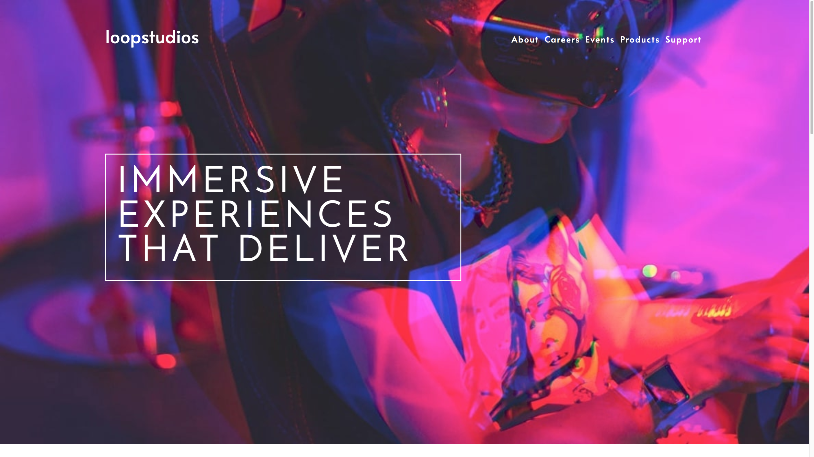

# Frontend Mentor - Loopstudios landing page solution

This is a solution to the [Loopstudios landing page challenge on Frontend Mentor](https://www.frontendmentor.io/challenges/loopstudios-landing-page-N88J5Onjw). Frontend Mentor challenges help you improve your coding skills by building realistic projects. 

## Table of contents

  - [Overview](#overview)
  - [The challenge](#the-challenge)
  - [Screenshot](#screenshot)
  - [Built with](#built-with)
  - [What I learned](#what-i-learned)
  - [Continued development](#continued-development)
  - [Useful resources](#useful-resources)
  - [Author](#author)

**Note: Delete this note and update the table of contents based on what sections you keep.**

## Overview

### The challenge

Users should be able to:

- View the optimal layout for the site depending on their device's screen size
- See hover states for all interactive elements on the page

### Screenshot

### Links

- Live Site URL: (https://fabiola971.github.io/loopStudios/)

### Built with

- Semantic HTML5 markup
- CSS custom properties
- Flexbox
- CSS Grid
- Mobile-first workflow

### What I learned

Usually Iwork with flex-box fot the layout I tried "grid" for more options when I code.

### Continued development

I apreciate "animation" and would like to continue with them to reach a better interactives pages, add to javascript method.

### Useful resources

- [AlsaCréations](https://www.alsacreations.com) - This helped me with responsive image
- [Example resource 2](https://www.example.com) - This is an amazing article which helped me finally understand XYZ. I'd recommend it to anyone still learning this concept.

## Author

- Website - [Fabiola Barul](https://github.com/Fabiola971)
- Frontend Mentor - [@Fabiola971](https://www.frontendmentor.io/profile/Fabiola971)
- Linkedin - [Fabiola BARUL](https://www.linkedin.com/in/fabiola-barul)

